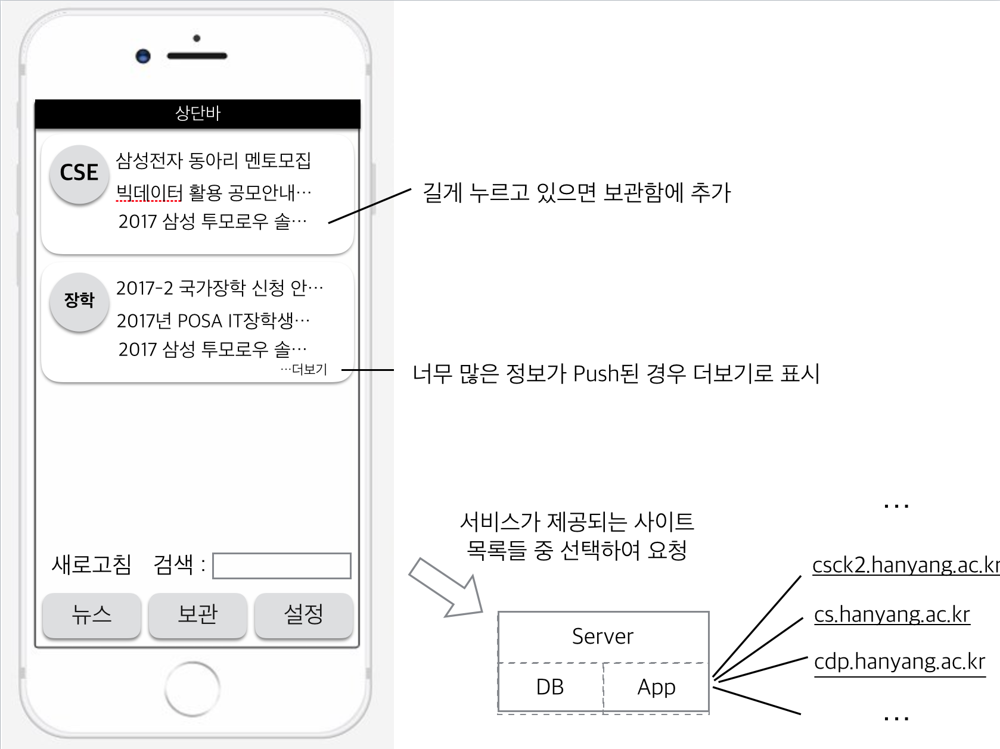

# HyLionPost

*.hanyang.ac.kr에 올라오는 유용한 정보들을 수닙해서 사용자에게 알려주는 App

### 개발취지

학교에서는 정말 중요한 정보는 문자와 '한양대학교' App을 통해 알려주지만, 유용한 정보(장학, 취업)임에도 우리가 모르고 지나가는 정보들이 정말 많습니다. **한양스팸**팀은 이를 해결하기 위해 각 과 홈페이지의 게시판에 유용한 정보(과 홈페이지 공지, 취업 정보, 강의별 공지) 들이 공지될 때 이런 정보들의 제목과 링크를 수집해서 사용자에게 뿌려주는 App, **HyLionPost**을 개발하고 있습니다.

### 구현방법
- Python Selenium, BeautifulSoup을 이용해 게시판마다 스레드를 생성해 웹 스크래핑
- iOS앱은 백그라운드 태스크로 할 수 있는 일이 제약적이므로, Firebase를 통한 APNS 이용
- Firebase DB에 게시글들을 저장한 후, 처음 게시판을 구독하는 경우 최근 10개의 게시글들을 읽어옴

### 첫화면

### 한양스팸 팀원

이영식 [@Sikurity](https://github.com/Sikurity) leejk9592@naver.com

정선욱 [@PineApple777](https://github.com/PineApple777) metaljsw2@naver.com

박선하 [@CameliaOvO](https://github.com/CameliaOvO) camelia0858@gmail.com

